```python
# needed
import numpy as np
import matplotlib.pyplot as plt
from sklearn import linear_model
from sklearn.preprocessing import MinMaxScaler, PolynomialFeatures
from sklearn.model_selection import train_test_split
import pandas as pd
from sklearn.svm import SVR
from sklearn.model_selection import GridSearchCV
import mpld3
from dataset import dataset

plt.style.use('seaborn')
```

# Loading the data files


```python
ds = dataset()
ds.build_train_set()
```


```python
ds.training_data.head()
```


<div>
<style scoped>
    .dataframe tbody tr th:only-of-type {
        vertical-align: middle;
    }

    .dataframe tbody tr th {
        vertical-align: top;
    }

    .dataframe thead th {
        text-align: right;
    }
</style>
<table border="1" class="dataframe">
  <thead>
    <tr style="text-align: right;">
      <th></th>
      <th>temp</th>
      <th>delta_t</th>
      <th>PERF_COUNT_HW_CPU_CYCLES</th>
      <th>PERF_COUNT_HW_INSTRUCTIONS</th>
      <th>PERF_COUNT_HW_CACHE_MISSES</th>
      <th>PERF_COUNT_HW_BRANCH_MISSES</th>
      <th>PERF_COUNT_HW_BRANCH_INSTRUCTIONS</th>
      <th>PERF_COUNT_HW_CACHE_LL_read_miss</th>
      <th>PERF_COUNT_HW_CACHE_L1D_read_miss</th>
      <th>d_temp</th>
    </tr>
  </thead>
  <tbody>
    <tr>
      <th>0</th>
      <td>61.224</td>
      <td>1.0</td>
      <td>1.199925e+09</td>
      <td>5.256063e+08</td>
      <td>2.029911e+06</td>
      <td>2.993070e+06</td>
      <td>5.071249e+07</td>
      <td>1.619228e+06</td>
      <td>2.029934e+06</td>
      <td>0.065357</td>
    </tr>
    <tr>
      <th>1</th>
      <td>67.142</td>
      <td>1.0</td>
      <td>1.047219e+09</td>
      <td>4.517474e+08</td>
      <td>2.017318e+06</td>
      <td>2.546153e+06</td>
      <td>4.366421e+07</td>
      <td>1.458473e+06</td>
      <td>2.017354e+06</td>
      <td>-0.167114</td>
    </tr>
    <tr>
      <th>2</th>
      <td>67.142</td>
      <td>1.0</td>
      <td>1.199941e+09</td>
      <td>5.194245e+08</td>
      <td>2.154760e+06</td>
      <td>2.930493e+06</td>
      <td>5.018391e+07</td>
      <td>1.628087e+06</td>
      <td>2.154797e+06</td>
      <td>0.046321</td>
    </tr>
    <tr>
      <th>3</th>
      <td>62.300</td>
      <td>1.0</td>
      <td>1.152591e+09</td>
      <td>5.029426e+08</td>
      <td>2.002572e+06</td>
      <td>2.866639e+06</td>
      <td>4.855847e+07</td>
      <td>1.577407e+06</td>
      <td>2.002598e+06</td>
      <td>0.026636</td>
    </tr>
    <tr>
      <th>4</th>
      <td>62.838</td>
      <td>1.0</td>
      <td>1.184833e+09</td>
      <td>5.161476e+08</td>
      <td>2.072373e+06</td>
      <td>2.931416e+06</td>
      <td>4.983194e+07</td>
      <td>1.612395e+06</td>
      <td>2.072402e+06</td>
      <td>0.031293</td>
    </tr>
  </tbody>
</table>
</div>


# Scaling the data


```python
# get the inputs and targets
X = ds.training_data.drop('d_temp', axis=1).to_numpy()
y = ds.training_data.d_temp.to_numpy()

# scale the data
scaler = MinMaxScaler()
Xs = scaler.fit_transform(X)

# show scaled data
pd.DataFrame(Xs, columns=ds.training_data.columns[:-1]).head()
```


<div>
<style scoped>
    .dataframe tbody tr th:only-of-type {
        vertical-align: middle;
    }

    .dataframe tbody tr th {
        vertical-align: top;
    }

    .dataframe thead th {
        text-align: right;
    }
</style>
<table border="1" class="dataframe">
  <thead>
    <tr style="text-align: right;">
      <th></th>
      <th>temp</th>
      <th>delta_t</th>
      <th>PERF_COUNT_HW_CPU_CYCLES</th>
      <th>PERF_COUNT_HW_INSTRUCTIONS</th>
      <th>PERF_COUNT_HW_CACHE_MISSES</th>
      <th>PERF_COUNT_HW_BRANCH_MISSES</th>
      <th>PERF_COUNT_HW_BRANCH_INSTRUCTIONS</th>
      <th>PERF_COUNT_HW_CACHE_LL_read_miss</th>
      <th>PERF_COUNT_HW_CACHE_L1D_read_miss</th>
    </tr>
  </thead>
  <tbody>
    <tr>
      <th>0</th>
      <td>0.533333</td>
      <td>0.0</td>
      <td>0.999930</td>
      <td>0.529043</td>
      <td>0.343477</td>
      <td>0.318502</td>
      <td>0.405086</td>
      <td>0.831527</td>
      <td>0.343474</td>
    </tr>
    <tr>
      <th>1</th>
      <td>0.900000</td>
      <td>0.0</td>
      <td>0.868291</td>
      <td>0.451190</td>
      <td>0.341318</td>
      <td>0.264593</td>
      <td>0.345262</td>
      <td>0.748606</td>
      <td>0.341317</td>
    </tr>
    <tr>
      <th>2</th>
      <td>0.900000</td>
      <td>0.0</td>
      <td>0.999944</td>
      <td>0.522527</td>
      <td>0.364881</td>
      <td>0.310954</td>
      <td>0.400600</td>
      <td>0.836097</td>
      <td>0.364881</td>
    </tr>
    <tr>
      <th>3</th>
      <td>0.600000</td>
      <td>0.0</td>
      <td>0.959126</td>
      <td>0.505154</td>
      <td>0.338789</td>
      <td>0.303252</td>
      <td>0.386804</td>
      <td>0.809955</td>
      <td>0.338788</td>
    </tr>
    <tr>
      <th>4</th>
      <td>0.633333</td>
      <td>0.0</td>
      <td>0.986920</td>
      <td>0.519073</td>
      <td>0.350756</td>
      <td>0.311065</td>
      <td>0.397612</td>
      <td>0.828003</td>
      <td>0.350755</td>
    </tr>
  </tbody>
</table>
</div>


# Modeling


```python
# create regressor
LM = linear_model.Ridge(alpha=1)

# train model
LM.fit(Xs, y)

# show trained model coefs
pd.DataFrame(LM.coef_, columns=['coef'], index=ds.training_data.columns[:-1])
```


<div>
<style scoped>
    .dataframe tbody tr th:only-of-type {
        vertical-align: middle;
    }

    .dataframe tbody tr th {
        vertical-align: top;
    }

    .dataframe thead th {
        text-align: right;
    }
</style>
<table border="1" class="dataframe">
  <thead>
    <tr style="text-align: right;">
      <th></th>
      <th>coef</th>
    </tr>
  </thead>
  <tbody>
    <tr>
      <th>temp</th>
      <td>-0.326307</td>
    </tr>
    <tr>
      <th>delta_t</th>
      <td>0.000000</td>
    </tr>
    <tr>
      <th>PERF_COUNT_HW_CPU_CYCLES</th>
      <td>-0.124478</td>
    </tr>
    <tr>
      <th>PERF_COUNT_HW_INSTRUCTIONS</th>
      <td>0.159300</td>
    </tr>
    <tr>
      <th>PERF_COUNT_HW_CACHE_MISSES</th>
      <td>0.022084</td>
    </tr>
    <tr>
      <th>PERF_COUNT_HW_BRANCH_MISSES</th>
      <td>0.312703</td>
    </tr>
    <tr>
      <th>PERF_COUNT_HW_BRANCH_INSTRUCTIONS</th>
      <td>0.285091</td>
    </tr>
    <tr>
      <th>PERF_COUNT_HW_CACHE_LL_read_miss</th>
      <td>0.265617</td>
    </tr>
    <tr>
      <th>PERF_COUNT_HW_CACHE_L1D_read_miss</th>
      <td>0.022162</td>
    </tr>
  </tbody>
</table>
</div>


# Predict on testing data


```python
for fname in ds.test_files:

    # load the test file with target calculated
    tdf = dataset._delta_temp_column(fname)

    # get the target
    truth = tdf.d_temp.to_numpy()

    # drop target from model input
    tdf = tdf.drop('d_temp', axis=1)

    # SCALE AND PREDICT
    tdfs = scaler.transform(tdf)
    pred = LM.predict(tdfs)

    # plot
    plt.figure(figsize=(12,5))
    plt.ylim((-5,20))
    plt.title(fname)
    plt.plot(range(len(truth)), np.cumsum(truth), 'g.-')
    plt.plot(range(len(pred)), np.cumsum(pred), 'r.-') 


```


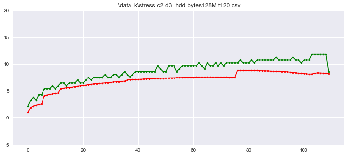


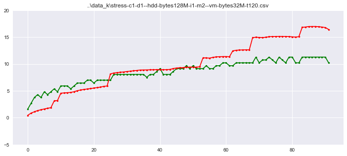


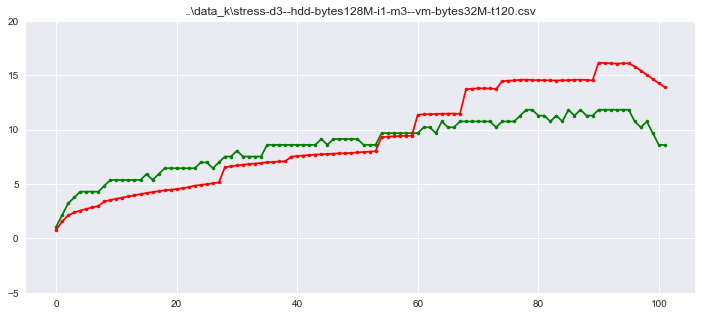


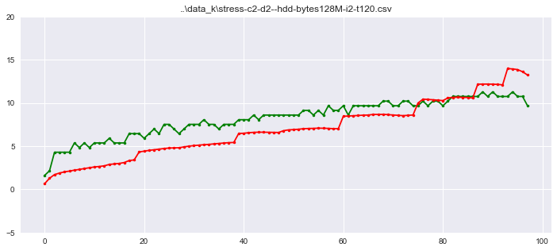


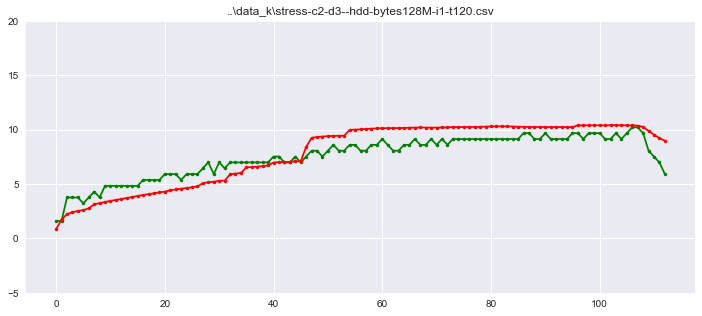


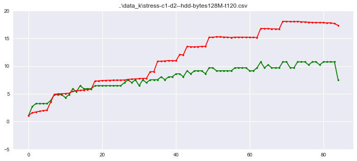


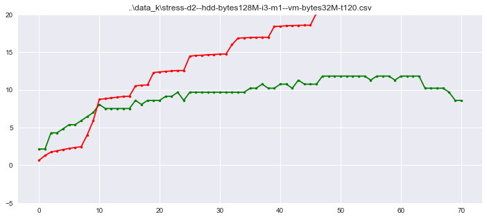


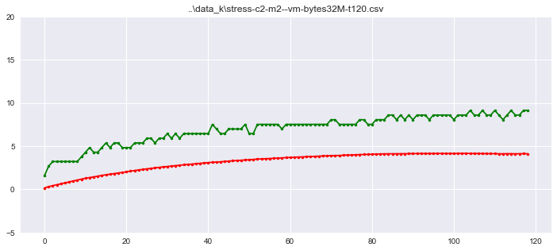


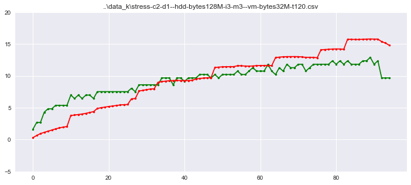


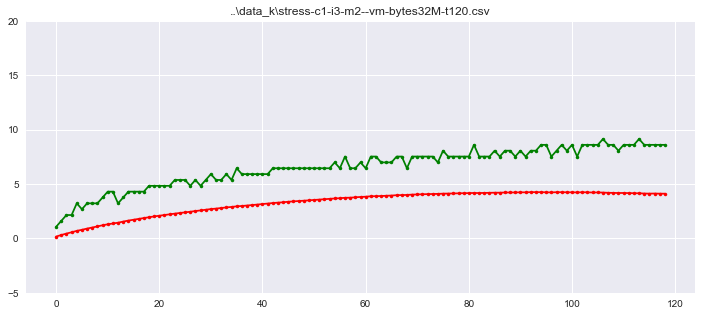


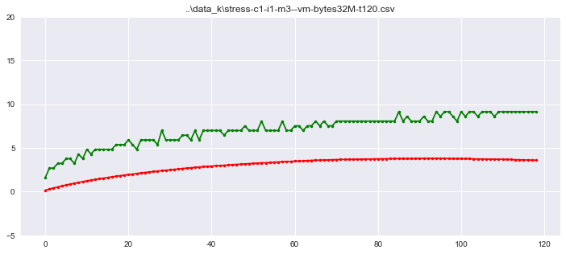


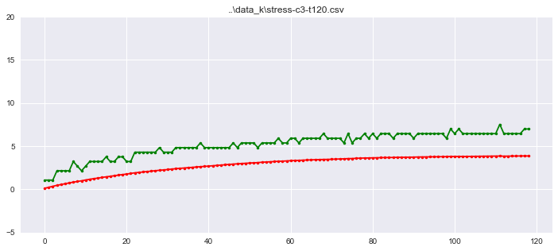


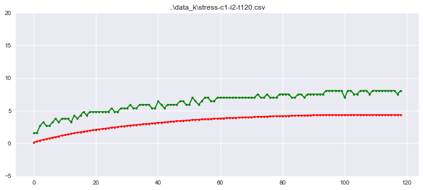


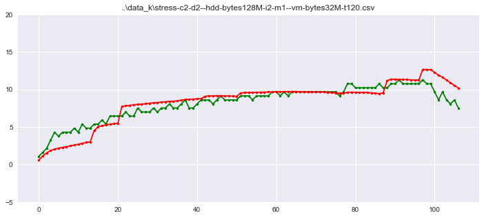


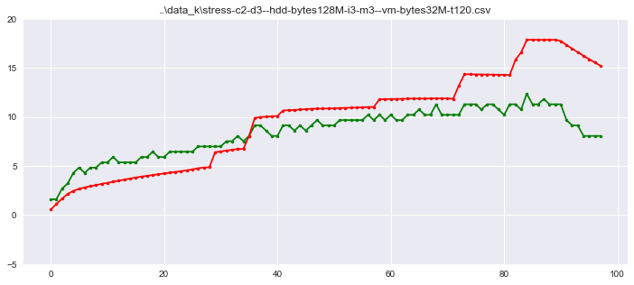


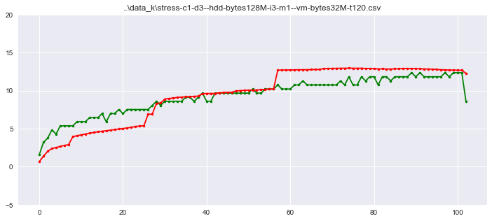


```python

```
